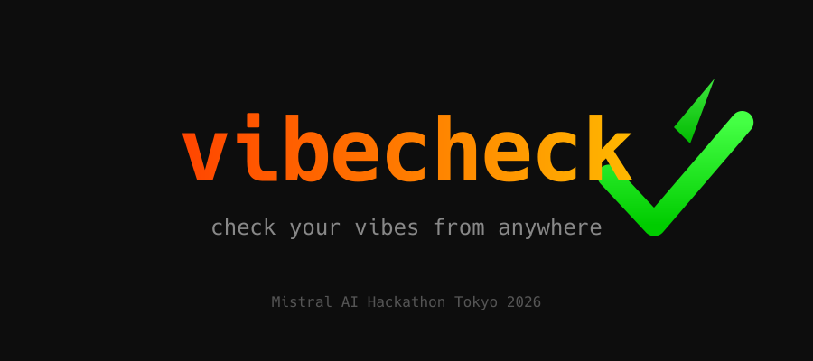
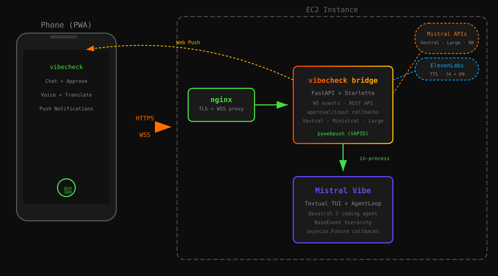
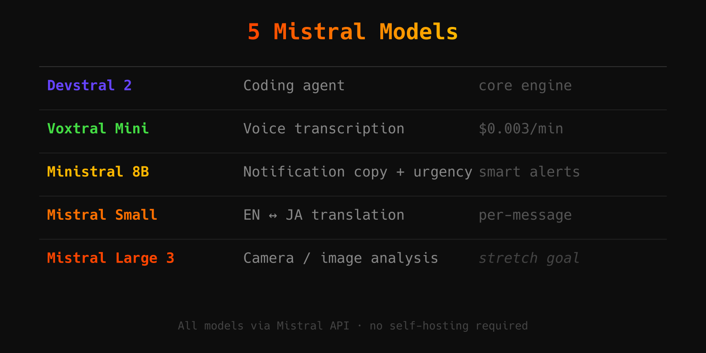

<!-- jump_to_middle -->


<!-- end_slide -->

The Problem
===

<!-- jump_to_middle -->

You're running **Mistral Vibe** — an AI coding agent.

It writes code, runs tests, builds features.

<!-- pause -->

Every few minutes it stops:

*"Can I run this command?"*
*"Should I create this file?"*

<!-- pause -->

You're **stuck at your desk**.

<!-- pause -->

What if you could check on your agent **from your phone**?

<!-- end_slide -->

The Approach
===

<!-- new_lines: 2 -->

Most agent bridges scrape terminal output or emulate PTYs.

<!-- pause -->

Vibe is built on **Textual** (Python TUI) with typed async events.

<!-- pause -->

We don't scrape — we **hook directly into the event system**:

```python
agent_loop.set_approval_callback(bridge.on_approval)
agent_loop.set_user_input_callback(bridge.on_input)
agent_loop.message_observer = bridge.broadcast
```

<!-- pause -->

Typed `BaseEvent` objects → structured data on the phone.

No tmux. No PTY. No parsing ANSI escape codes.

<!-- end_slide -->

Architecture
===

<!-- jump_to_middle -->


<!-- end_slide -->

5 Mistral Models
===

<!-- jump_to_middle -->


<!-- end_slide -->

What It Does
===

<!-- new_lines: 2 -->

<!-- incremental_lists: true -->

- **Approve tool calls** from your phone (or lock screen)
- **Voice input** — speak Japanese, Voxtral transcribes
- **Push notifications** — phone buzzes when agent needs you
- **Translation** — EN↔JA toggle on any message
- **Smart alerts** — Ministral writes notification copy + urgency
- **Intensity slider** — 😴 Chill → 🎵 Vibing → 💀 Ralph

<!-- end_slide -->

Demo Time
===

<!-- jump_to_middle -->
<!-- font_size: 2 -->

Let's see it live.

<!-- pause -->

*press **q** to exit slides → live demo*

<!-- end_slide -->
